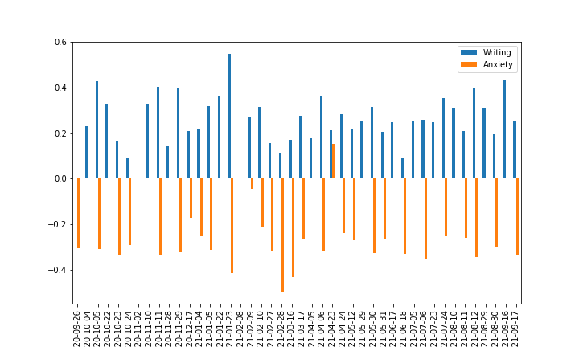
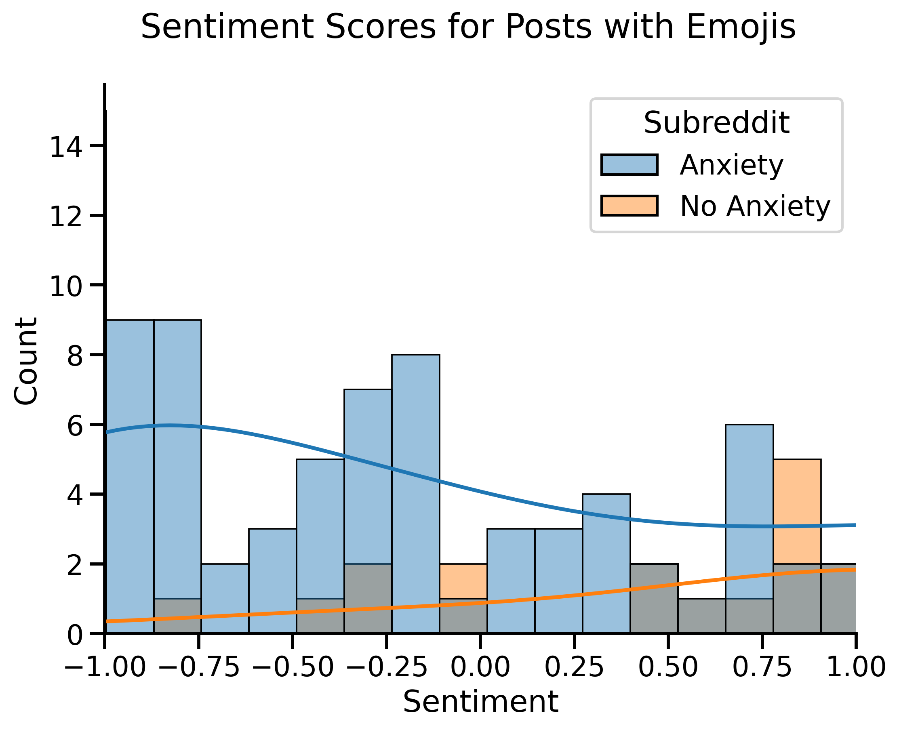

# "Are you feeling anxious right now? Take this moment to a breath."

*By Azin Faghihi, Ihza Gonzales and Suelem Lee

## Project Structure

1. README.md
2. Executive Summary
3. Jupyter Notebooks
4. Python File
4. PDF File
5. Datasets

## Identified Need
About 19% of adults have an anxiety disorder (Anxiety disorders, 2017). To put this in perspective that is over 40 million people in the US with anxiety. Now one’s choice of words even punctuation can hint at the mental or emotional status of a person (Havigerová et al., 2019). There are systems already created for the purpose of analyzing text to provide feedback about a person like the system, TensiStrength (Thelwall, 2016).

## Problem Statement
The goal is to create a similar system with posts from the anxiety subreddit and classify them into varying degrees of anxiety and provide tailored messages to address anxiety levels with a Chatbot response system, based on their anxiety level.

## Data Description

Posts evaluated from anxiety and writing (neutral sentiment) subreddit: Web Scraping of following websites:

https://www.reddit.com/search/?q=anxiety
https://www.reddit.com/r/writing/
Decision making were based on a easy to perform initial screening tool for generalized anxiety disorder provided by the National HIV Curriculum: https://www.hiv.uw.edu/page/mental-health-screening/gad-7 https://www.hiv.uw.edu/page/mental-health-screening/gad-2

### Data Dictionary

## Methodology

**The analysis of scrapped texts will be used in hopes of classifying users messaging anxiety levels:**

Not Anxious
Anxious
Severe Anxiety

Writing subreddit helps Classification for it's predominant positive neutral language.

**Models used to Classify anxiety levels are:**

Multinomial Naive Bayes
Random Forest
Logistic Regression
Best params:

## Best parameters
Adjusted term weights: Methods to detect expressions of stress within short informal messages were SentimentIntensityAnalyser extended from Classifying models, where the ajdusted term weights were evaluated to improve performance of Classification.

1. Repeated consecutive letters
2. Frequency of Punctuation use
3. Various different use of Emoticons

**Evidence of improvement:** The improvements suggest that additional fine tuning of the term strengths is necessary. The supervised version of our 3 models are preferable to the unsupervised variant, using Tfdif Vectorizer and Count Vectorizer only. Using bigrams hyperparameters for combined additional linguistic negation. After Classifying existance of anxiety on each post, we used a SentimentIntensityAnalyser to classify the intensity of the anxiety of that particular post.

Repeated consecutive letters present on corpus - Eq. "Wooooorrrried" carries a higher weight on sentiment intensity than "worried"
Repeated Puntuations over 3 repetitions - Repeated exclamation and interrogation marks adds a higher strength to sentiment than repeated "...", which was also considered as a anxious indicator on a lower level of -0.5.
Emoticons used - corresponding to their sentiment different weights were assigned as anxiety indicators, such as ......
EDA Bigrams analysis Emoticon analysis Common short words

## Prediction Results
MultinomialNB 

**Logistic Regression:** 
Best Score: 0.9511904761904761 
Best Parameters:  {'logr__C': 3,  'logr__max_iter': 2000,  'logr__penalty': 'l2',  'logr__solver': 'saga'} 
Train Score: 0.9921428571428571 
Test Score: 0.9483333333333334 

**Random Forest:**
Best Score: 0.9531035939090995 
Best Parameters: {'rf__max_depth': None,  'rf__max_features': 'sqrt',  'rf__n_estimators': 80,  'tvec__max_features': 2000,  'tvec__ngram_range': (1, 2),  'tvec__stop_words': None} 
Train Score: 0.9985569985569985 
Test Score: 0.9556926528323051 

Clustering

## Software Requirements

## Conclusion

Overall performance of models and sentiment analysis confirms how well we can accurately classify 3 levels of anxiety. It needs to be extended and tested in different contexts and tailored with specific types of anxiety linguistics.

Relaxation is an important aspect of our lives and becoming even more relevant to our virtually connected lives. This anxiety detection app can help to enable smarter applications as well as extending our understanding of our conditions, helping to monitor our overall mental health and ultimately resulting in a punctual accessible more intimate solution for this great demand.

## Recommendation for next steps

1. Analyze further types of ambiguous expressions such as sarcasm.

2. Further analyze events, perceptions or experiences that can cause anxiety or expressed on texts.

3. Further analyze how to physically classify anxiety levels through cellphone cameras and touchscreens, detecting bodily responses, like sweat, heart rate, flushed skin tone, temblings and breathings.

4. Further analyze how to extend to another classification method to analyse long term health related anxiety or short-term anxiety, identifying trends and maybe even predict future occurances, of panic attack or anxiety break.

## Research Sources

Sources: Thelwall, M. (2016, July 12). TensiStrength: Stress and relaxation magnitude detection for social media texts. Science Direct. Retrieved September 16, 2021, from https://www.sciencedirect.com/science/article/abs/pii/S0306457316302321. Havigerová, J. M., Haviger, J., Kučera, D., & Hoffmannová, P. (2019, March 18). Text-based detection of the risk of depression. Frontiers. Retrieved September 16, 2021, from https://www.frontiersin.org/articles/10.3389/fpsyg.2019.00513/full. National Alliance of Mental Illness. (2017, December). Anxiety disorders. NAMI. Retrieved September 16, 2021, from https://www.nami.org/About-Mental-Illness/Mental-Health-Conditions/Anxiety-Disorders. Python | Sentiment Analysis using VADER https://www.geeksforgeeks.org/python-sentiment-analysis-using-vader/