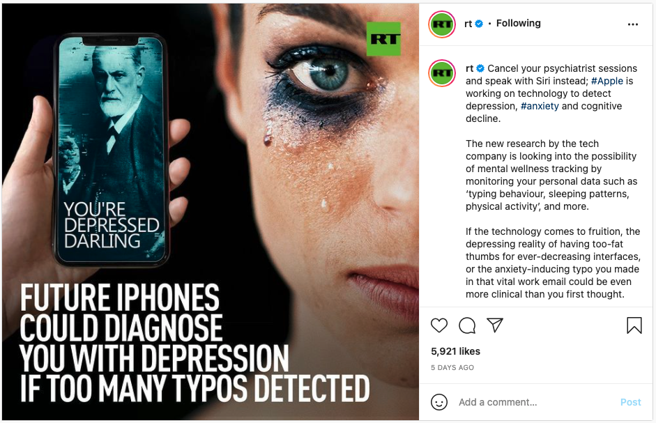
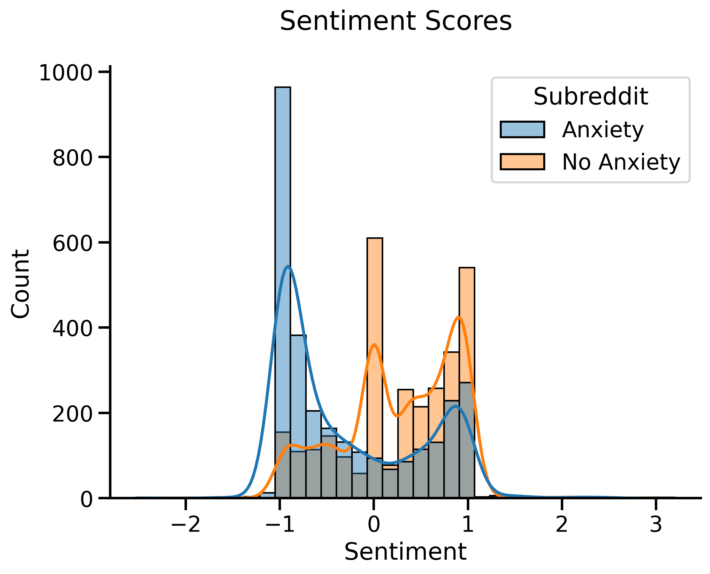
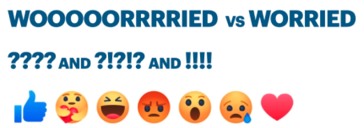
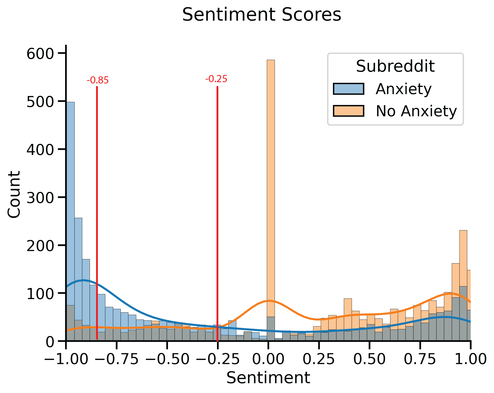

# "Are you feeling anxious right now? Take this moment to take a breath."

*By Azin Faghihi, Ihza Gonzales and Suelem Lee*

## Project Structure

1. README.md
2. [Executive Summary](https://github.com/Ihza430/GA_Project_5/blob/main/Executive_summary.pdf)
3. Code
    

1. Azin Faghihi

    

1. Jupyter Notebooks (4)

    - Azin_01_combine_data.ipynb  
    - Azin_02_process_model_data_EDA.ipynb  
    - Azin_03_study_models_vizualization.ipynb  
    - Azin_04_study_data_extra_EDA.ipynb  
    

    

2. Python File (1)

    - emoji_sentiment_tools_simple.py
    

     
    

   

2. Ihza Gonzales

   

1. Jupyter Notebooks (3)

    - Ihza_1_data_cleaning.ipynb  
    - Ihza_2_logistic_regression.ipynb   
    - Ihza_3_sentiment_analysis.ipynb
   

   

2. Chatbot Code

       

1. Python Files

        - sentiment.py 
        - processor.py 
        - chatbot.py 
        - app.py   
       

       

2. Templates

        - index.html 
        - result.html 
        - chatbot.html   
       

   

    
   

   

3. Suelem Lee

   

4. 

Presentation

    - Project-5-Presentation.pdf  
    - images
   

5. 

Datasets(3)

    - anxiety_submissions.csv  
    - anxiety_writing.csv  
    - writing_submissions.csv  
   

## Identified Need
About 19% of adults have an anxiety disorder (Anxiety disorders, 2017). To put this in perspective that is over 40 million people in the US with anxiety. Now one’s choice of words even punctuation can hint at the mental or emotional status of a person (Havigerová et al., 2019). There are systems already created for the purpose of analyzing text to provide feedback about a person like the system, TensiStrength (Thelwall, 2016).

In the United States, the most common type of mental disorders is different kinds of anxiety. 
1. Panic attack symptoms are so severe that they lead patients to believe they are suffering heart attacks.  
2. The actual increased Risk of Heart Attack Panic attacks and chronic anxiety put a lot of stress on the heart with increased blood pressure and pulse. 
3. More Stress Hormones too much adrenaline or cortisol over a long period of time can cause, cognitive decline, Increased risk for other mental illnesses, Higher cholesterol  
4. Insomnia can lead to Weakened immune system, Unwanted weight gain... 

While medications can treat many of these problems, we see the importance of preventive medicine in which needs to be addressed. 

## Problem Statement
From anxiety subreddit can we classify them into varying degrees of anxiety and provide tailored messages to address anxiety levels with a Chatbot response system?

## Data Description

Posts evaluated from anxiety and writing (neutral sentiment) subreddit: Web Scraping of following websites: 
https://www.reddit.com/search/?q=anxiety 
https://www.reddit.com/r/writing/ 

Decision making were based on a easy to perform initial screening tool for generalized anxiety disorder provided by the National HIV Curriculum:  https://www.hiv.uw.edu/page/mental-health-screening/gad-7 https://www.hiv.uw.edu/page/mental-health-screening/gad-2

## Methodology

1. EDA
2. Modeling for anxiety Classification
3. Sentiment analysis to further classify severity of anxiety
4. Chatbot for immediate response

**The analysis of scrapped texts will be used in hopes of classifying users messaging anxiety levels as Binary Classification:** 
>Not Anxious 
>Anxious 

Writing subreddit helps Classification for it's predominant positive neutral language.

## Best parameters

**Adjusted term weights:**   Methods to detect expressions of stress within short informal messages were SentimentIntensityAnalyser extended from Classifying models, where the ajdusted term weights were evaluated to improve performance of Classification.

>1. Repeated consecutive letters 
>2. Frequency of Punctuation use 
>3. Various different use of Emoticons 

**Evidence of improvement:** The improvements suggest that additional fine tuning of the term strengths is necessary. The supervised version of our 3 models are preferable to the unsupervised variant, using Tfdif Vectorizer and Count Vectorizer only. Using bigrams hyperparameters for combined additional linguistic negation. After Classifying existance of anxiety on each post, we used a SentimentIntensityAnalyser to classify the intensity of the anxiety of that particular post.

## Threshold denomination

## Best Prediction Results

**Logistic Regression:** 
Best Score: 0.951 
> Best Parameters:  {'logr__C': 3,  
>'logr__max_iter': 2000,  
>'logr__penalty': 'l2',  
>'logr__solver': 'saga'} 

Train Score: 0.992 
Test Score: 0.948 

**Random Forest:**
Best Score: 0.953 
>Best Parameters: {'rf__max_depth': None,  
>'rf__max_features': 'sqrt',  
>'rf__n_estimators': 80,  
>'tvec__max_features': 2000,  
>'tvec__ngram_range': (1, 2),  
>'tvec__stop_words': None} 

Train Score: 0.998 
Test Score: 0.955 

## Conclusion

Overall performance of models and sentiment analysis confirms how well we can accurately classify 3 levels of anxiety. It needs to be extended and tested in different contexts and tailored with specific types of anxiety linguistics.

At this stage, the effectiveness of this Classifier depends on the nature of of the posts classified, rich in words and expressions of anxiety terms being more problematic in an analysable context.

Relaxation is an important aspect of our lives and becoming even more relevant to our virtually connected lives. This anxiety detection app can help to enable smarter applications as well as extending our understanding of our conditions, helping to monitor our overall mental health and ultimately resulting in a punctual accessible more intimate solution for this great demand.

## Recommendation for next steps

1. Analyze further types of ambiguous expressions such as sarcasm.

2. Further analyze events, perceptions or experiences that can cause anxiety or expressed on texts.

3. Further analyze how to physically classify anxiety levels through cellphone cameras and touchscreens, detecting bodily responses, like sweat, heart rate, flushed skin tone, temblings and breathings.

4. Further analyze how to extend to another classification method to analyse long term health related anxiety or short-term anxiety, identifying trends and maybe even predict future occurances, of panic attack or anxiety break.

## Research Sources

Sources: Thelwall, M. (2016, July 12). TensiStrength: Stress and relaxation magnitude detection for social media texts. Science Direct. Retrieved September 16, 2021, from https://www.sciencedirect.com/science/article/abs/pii/S0306457316302321. 
Havigerová, J. M., Haviger, J., Kučera, D., & Hoffmannová, P. (2019, March 18). 

Text-based detection of the risk of depression. Frontiers. Retrieved September 16, 2021, from https://www.frontiersin.org/articles/10.3389/fpsyg.2019.00513/full.  

National Alliance of Mental Illness. (2017, December). Anxiety disorders. NAMI. Retrieved September 16, 2021, from https://www.nami.org/About-Mental-Illness/Mental-Health-Conditions/Anxiety-Disorders.  

Python | Sentiment Analysis using VADER https://www.geeksforgeeks.org/python-sentiment-analysis-using-vader/ 